# Contribution Board

Ta grille de contributions GitHub racontée autrement : pas un graphique statique, mais une petite scène qui rejoue tes vrais commits — un canon qui vise, une marée qui découvre des coquillages, un sonar qui détecte, une pluie de météores qui s'écrase, un jardin qui pousse. Chaque style lit les mêmes données réelles (l'API GraphQL de GitHub), juste mises en scène différemment.

Zéro dépendance externe (Node 20+, `fetch` global), self-hosted via GitHub Action — pas d'instance tierce qui peut tomber en panne, tout tourne chez toi.

| Style | Aperçu |
|---|---|
| `cannon` | Un canon fixe, planté dans un coin, qui pivote pour viser et tire un carré coloré sur chaque commit, au bon endroit et au bon moment. |
| `tide` | Une marée qui avance, recouvre la grille, puis se retire en laissant un coquillage sur chaque commit. |
| `sonar` | Les jours avec le plus de commits deviennent des émetteurs qui balaient en continu ; chaque autre jour actif est détecté au moment où le ping le plus proche l'atteint. |
| `meteor` | Une pluie de météores tombe à intervalles irréguliers et s'écrase sur chaque commit, laissant un cratère coloré et un éclat de particules qui se dissipe. |
| `constellation` | Un point lumineux relie chaque commit par une ligne fine, dessinant une constellation qui prend forme au fil du temps. |
| `garden` | Toute la grille devient un lit de terre ; chaque jour actif fait pousser une plante différente selon son niveau d'activité — herbe, fleur, puis arbre — dans l'ordre chronologique, comme un vrai jardin sur la saison. |

## Démos

| Style | Aperçu | Description |
|---|---|---|
| [`cannon`](src/styles/cannon.mjs) |  | Un canon fixe, planté dans un coin, qui pivote pour viser et tire un carré coloré sur chaque commit, au bon endroit et au bon moment. |
| [`tide`](src/styles/tide.mjs) |  | Une marée qui avance, recouvre la grille, puis se retire en révélant une trouvaille de plage sur chaque commit (🐚 / 🦪 / 🦀 / 🐙 selon le nombre de commits du jour). |
| [`sonar`](src/styles/sonar.mjs) |  | Les 5 jours avec le plus de commits deviennent des émetteurs (rouges, clignotants) qui balaient en continu ; chaque autre jour actif est détecté au moment où le ping le plus proche l'atteint. |
| [`meteor`](src/styles/meteor.mjs) |  | Des météores tombent à intervalles irréguliers et s'écrasent sur chaque commit, laissant un cratère et un éclat de particules qui se dissipe. |
| [`garden`](src/styles/garden.mjs) |  | Toute la grille devient un lit de terre ; chaque jour actif fait pousser une plante selon son niveau d'activité (herbe → fleur → arbre), dans l'ordre chronologique, jusqu'à pleine floraison puis fanaison avant la boucle suivante. |

Les aperçus ci-dessus sont générés depuis de vraies données (voir [Développement local](#développement-local) pour les régénérer) — GitHub anime les SVG normalement dans le rendu du README, pas besoin de GIF.

D'autres styles sont les bienvenus (voir [Ajouter un style](#ajouter-un-style) plus bas) — l'idée est justement d'en accumuler.

## Installation

Dans le dépôt de ton profil (`ton-pseudo/ton-pseudo`), ajoute un workflow qui génère le SVG et le commite :

```yaml
name: Contribution Board
on:
  schedule: [{ cron: "0 3 * * *" }]
  workflow_dispatch:
permissions:
  contents: write
jobs:
  board:
    runs-on: ubuntu-latest
    steps:
      - uses: actions/checkout@v4
      - uses: zaderlyl/contribution-board@v1
        with:
          github_token: ${{ secrets.GITHUB_TOKEN }}
          username: ${{ github.repository_owner }}
          style: cannon # ou tide / sonar / meteor / constellation / garden
          output: assets/contribution-board.svg
      - run: |
          if [[ -n "$(git status --porcelain assets/contribution-board.svg)" ]]; then
            git config user.name "github-actions[bot]"
            git config user.email "github-actions[bot]@users.noreply.github.com"
            git add assets/contribution-board.svg
            git commit -m "chore: mise à jour du contribution board"
            git pull --rebase origin main
            git push
          fi
```

Puis dans ton `README.md` :

```markdown

```

### Options

| Input | Défaut | Description |
|---|---|---|
| `username` | — | Compte GitHub (obligatoire) |
| `github_token` | — | `secrets.GITHUB_TOKEN` suffit pour un profil public (obligatoire) |
| `style` | `cannon` | `cannon` / `tide` / `sonar` / `meteor` / `constellation` / `garden` |
| `output` | `contribution-board.svg` | Chemin du SVG généré |
| `accent` | `ff9100` | Couleur d'accent (hex, sans `#`) — pas encore utilisée par tous les styles |
| `background` | `#0d1117` | Couleur de fond |

### Changer de style

Édite la valeur `style:` dans ton workflow et commit. Ce n'est **pas automatique** :

- le fichier YAML change tout de suite, mais le SVG affiché sur ton profil ne se régénère que quand le workflow tourne réellement ;
- par défaut, ça arrive au prochain déclenchement du `cron` (une fois par jour) ;
- pour voir le changement tout de suite, lance le workflow à la main : onglet **Actions** de ton dépôt profil → le workflow → **Run workflow**.

## Architecture

```
src/
  lib/
    contributions.mjs   # récupération des contributions (GraphQL) + géométrie de grille — partagé
  styles/
    cannon.mjs           # un style = un module, voir plus bas
    tide.mjs
    sonar.mjs
    meteor.mjs
    constellation.mjs
    garden.mjs
  generate.mjs           # CLI : fetch les données, choisit le style, écrit le SVG
action.yml               # empaquetage en GitHub Action composite (pas de bundling — juste Node natif)
```

Chaque style est un module `.mjs` indépendant qui exporte deux choses :

```js
export const meta = { id, label, description }; // pour un futur catalogue / le README

export function render(days, opts) {
  // `days` : liste de { col, row, count, level } — un par jour de l'année,
  // déjà positionné dans la grille (col = semaine, row = jour de semaine).
  // `opts` : { accent, background, cycle } passés depuis generate.mjs / action.yml.
  return "<svg>...</svg>";
}
```

`src/lib/contributions.mjs` est la seule partie qui parle au réseau (API GraphQL) — tout le reste ne manipule que des données déjà en mémoire, ce qui rend chaque style testable en local sans y retoucher.

### Ajouter un style

1. Nouveau fichier dans `src/styles/ton-style.mjs`, même forme que ci-dessus
2. L'enregistrer dans `STYLES` (`src/generate.mjs`)
3. Tester en local (voir ci-dessous) et **vérifier visuellement dans un navigateur** — un bug d'animation CSS/SVG ne se voit pas en relisant le code, seulement en le regardant tourner
4. Une branche par style (voir les branches existantes), PR vers `main` quand c'est prêt

## Développement local

```bash
GITHUB_TOKEN=$(gh auth token) node src/generate.mjs <pseudo> cannon out.svg
```

Sers le fichier généré (`python3 -m http.server`) et ouvre-le dans un navigateur pour vérifier l'animation avant de committer — un SVG animé en CSS ne s'anime pas dans un aperçu de fichier statique, et certains bugs (par exemple un élément qui atterrit à la mauvaise position) ne se voient qu'en le regardant tourner en vrai.

## Licence

MIT
